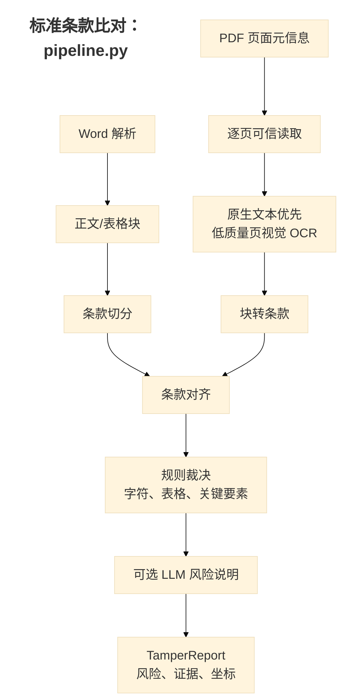
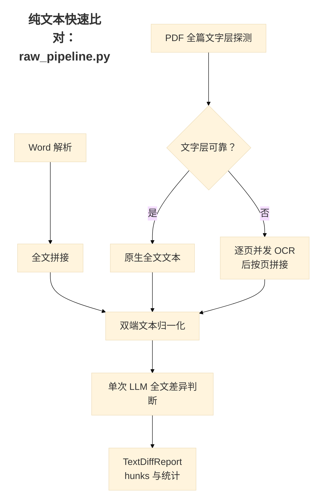

# 合同对比两套管线逻辑对比

## 结论摘要

系统提供两条彼此隔离的合同对比管线：

- **标准条款比对管线**（`pipeline.py`，接口 `/api/v1/compare`）：先把 Word 与 PDF 转为带结构和位置的条款，再逐条对齐、用确定性规则裁决差异与风险。这是适合正式核验、需要定位和可追溯报告的主流程。
- **纯文本快速比对管线**（`raw_pipeline.py`，接口 `/api/v1/raw-compare`）：将两份文件分别汇总为全文文本，归一化后由一次 LLM 调用直接找关键差异。这是适合快速初筛的轻量流程。

两者的核心区别不在于是否使用 OCR，而在于**是否保留合同结构并以规则进行裁决**。标准版将 LLM 限制在 OCR 和可选的风险说明环节；快速版则让 LLM 直接决定差异清单，因此速度和语义容错更好，但稳定性、审计性和定位能力较弱。

## 处理流程

## 分阶段对比

| 维度 | 标准条款比对管线 | 纯文本快速比对管线 |
| --- | --- | --- |
| 入口 | `run_pipeline(word_path, pdf_path, ...)` | `run_raw_pipeline(word_path, pdf_path, ...)` |
| 对外接口 | `POST /api/v1/compare` | `POST /api/v1/raw-compare` |
| Word 输入 | `parse_word` 后保留正文块、表格与条款层级 | `parse_word` 后仅将有文本的块以换行拼成全文 |
| PDF 读取策略 | 逐页读取；每页优先 PyMuPDF 原生文本，低质量页才走视觉 OCR | 先对整份 PDF 的原生文字层做累计可靠性判断；不可靠时逐页并发 OCR，再按页序拼成全文 |
| OCR 输出 | 结构化块，可包含版面、表格和坐标 | 每页纯文本；不保留条款/表格结构和坐标 |
| 文本归一化 | 对齐和裁决阶段分别使用归一化、canonical 要素抽取及表格规范化 | 仅在全文进入 LLM 前调用 `normalize_text` |
| 对齐方式 | 编号锚定 → 字段锚定 → 归一化文本精确匹配 → 向量全局单调匹配 → 未匹配条款 | 不做程序化对齐；LLM 按提示词自行按语义段落或条款对照 |
| 差异判定 | 逐条字符 diff、表格单元格 diff、金额/日期/账号/主体等要素强校验；OCR 易混字符和纯格式差异进入复核 | LLM 直接输出 `replace` / `delete` / `insert` 差异块与整体相似度 |
| 风险结论 | 输出 `overall_risk`、`change_status`、风险原因、置信度、关键要素变化；可选 LLM 只能补充或提高风险，不能降低规则下限 | 不输出风险等级或确定性裁决；只输出 hunks、LLM 相似度和聚合统计 |
| 识别质量门禁 | 汇集逐页诊断并应用质量门禁；低质量识别会使结果进入 `needs_review` | 记录整篇读取诊断；全文不可用时标记 `needs_review`，但不对每个差异块建立页级证据 |
| 输出与展示 | JSON、带 PDF 坐标标注的 PDF、Word 高亮 DOCX、Word 预览 | JSON 报告；前端展示纯文本差异 |

## 标准条款比对管线详解

### 1. 输入结构化

Word 端通过 `parse_word` 解析正文和表格，随后 `build_clauses` 生成条款。PDF 端先读取页面尺寸等元信息，再使用 `TrustedPDFReader`：每一页若原生文本足够可靠则直接使用；否则仅将该页交给所选的 LLM/PaddleOCR 引擎。OCR 块再经 `blocks_to_raw` 和 `build_clauses` 变成 PDF 条款。

该设计的直接收益是：同一份混合 PDF 可以同时使用原生文本和 OCR，且差异可以关联到 PDF 页面的矩形区域。

### 2. 条款对齐

`align_clauses` 依次采用五层策略：

1. 相同的条款编号和层级按出现顺序配对。
2. 对无编号的甲乙方、账号、地址等字段按字段名配对。
3. 忽略排版空白后完全相同的文本配对。
4. 对余下条款进行向量相似度的全局单调最优匹配，避免合同顺序交叉。
5. 不能配对的条款分别作为 PDF 新增或 Word 缺失处理。

向量相似度在本流程中用于“找同一条款”，而不用于宣布两条款内容一致。

### 3. 差异与风险裁决

已配对条款通过 `adjudicate_clause_pair` 处理。它会执行字符级差异、表格结构差异、金额/比例/日期/主体/账号等关键要素的 canonical 校验，并结合 OCR 易混字符、空格与标点等规则给出：

- `status`：一致、修改、新增或缺失；
- `verdict`：`clean`、`changed`、`needs_review`；
- `risk_level`：风险等级与理由；
- `confidence`：证据置信度；
- `segments` 与 `page_regions`：可展示的变更证据和 PDF 定位。

若请求启用 `enable_llm_judge`，LLM 只对已确认修改条款补充风险说明；最终风险取规则和 LLM 建议的较高值，不能用 LLM 抵消确定性发现。

## 纯文本快速比对管线详解

### 1. 全文文本构造

Word 端将解析出的文本块直接拼成全文。PDF 端首先调用 `extract_native_full_text`，以整份文档累计的原生文本字符数判断文字层是否可靠；可靠时直接使用全文原生文本。不可靠时，`ocr_whole_document` 将 PDF 按页渲染并受并发限制地 OCR，最后按原页面顺序拼接。

两端全文随后经 `normalize_text` 统一 Unicode、换行与行内空白。这里的归一化不恢复条款层级或表格单元格边界。

### 2. LLM 全文判断

`llm_text_diff` 将两段全文一次性提交给配置的 `judge_*` 文本模型，要求它忽略 OCR 排版噪声，只报告金额、日期、主体、账号、义务责任等实质性变化。模型返回结构化 JSON：

- `hunks`：`replace`、`delete`、`insert` 三类差异；
- `word_lines` / `pdf_lines`：双方对应片段；
- `similarity`：LLM 对关键内容相似度的估计；
- 可选 `char_segments`：仅在 `char_level=true` 且单行替换时由 LLM 生成。

调用或 JSON 解析失败会直接使任务失败，不会回退到确定性 diff。

## 适用场景与选型

| 场景 | 推荐管线 | 原因 |
| --- | --- | --- |
| 合同篡改核验、审批拦截、审计留档 | 标准条款比对 | 有结构化证据、风险等级、置信度和页坐标，可输出标注文件 |
| 金额、期限、主体、账号、违约责任等高风险要素核验 | 标准条款比对 | 关键要素由规则强校验，结果不完全依赖 LLM 输出稳定性 |
| 需要指出新增/删除发生在哪一条、哪一页 | 标准条款比对 | 条款编号、对齐结果和 `page_regions` 可追溯 |
| 人工复核前的快速筛查 | 纯文本快速比对 | 省去条款切分、向量对齐和逐条裁决，语义级摘要更直接 |
| 文档结构很差、条款编号混乱，但只需找明显语义差异 | 纯文本快速比对（结果需复核） | LLM 可按语义尝试对照，但缺少确定性证据链 |
| 长合同或严格 SLA | 优先标准版；必要时评测快速版 | 快速版一次请求携带全文，可能受上下文窗口、输出长度和模型响应时间影响；标准版的工作量随条款数增加，但每步可观测且可定位 |

## 主要风险与注意事项

1. **快速版的结果不是确定性裁决。** 它的差异列表、相似度和可选字符片段均来自 LLM；同样输入在模型、上下文窗口或服务状态变化时可能产生不同结果。
2. **快速版的“字符级”并非本地字符 diff。** `char_level=true` 只是要求 LLM 为符合条件的替换片段返回字符段，不能视为精确逐字校验。
3. **全文模式的 PDF 原生文本采用整篇判断。** 原生文字层只要累计达到阈值即被接受；若 PDF 同时含可靠文本页和扫描页，快速版不会像标准版一样逐页混合读取，可能遗漏扫描页信息。这类混合文档宜使用标准版。
4. **快速版没有 PDF 坐标和 DOCX/PDF 标注产物。** hunk 的上下文只能帮助人工搜索，不能可靠地回跳到原始页面。
5. **标准版的结构质量仍是前提。** 条款切分、OCR 表格识别或编号识别错误会影响对齐；系统通过逐页诊断、未配对条款和 `needs_review` 降低误判风险，但不能取代人工复核。

## 建议的产品定位

- 将标准条款比对定位为“**正式核验 / 可出具报告**”模式，并作为涉及自动放行或风险提示的默认选择。
- 将纯文本快速比对定位为“**快速初筛 / 辅助阅读**”模式，页面上应明确其结果需要人工确认，不应单独驱动自动放行或拒绝。
- 对混合文本层 PDF、需要标注下载、或发现关键字段变化的任务，可从快速版引导用户重新运行标准版，以获得可审计证据。

## 代码索引

| 职责 | 标准条款比对 | 纯文本快速比对 |
| --- | --- | --- |
| 流水线入口 | `src/document_comparison/pipeline.py` | `src/document_comparison/raw_pipeline.py` |
| API 端点 | `src/document_comparison/api/app.py` 中 `/api/v1/compare` | `src/document_comparison/api/app.py` 中 `/api/v1/raw-compare` |
| 异步任务 | `TaskManager.run` | `TaskManager.run_raw` |
| PDF 读取 | `ocr/trusted.py` | `ocr/whole_doc.py` |
| 对齐/裁决 | `align/matcher.py`、`compare/adjudication.py` | 无独立对齐；`compare/llm_diff.py` 直接调用 LLM |
| 报告模型 | `TamperReport` | `TextDiffReport` |
