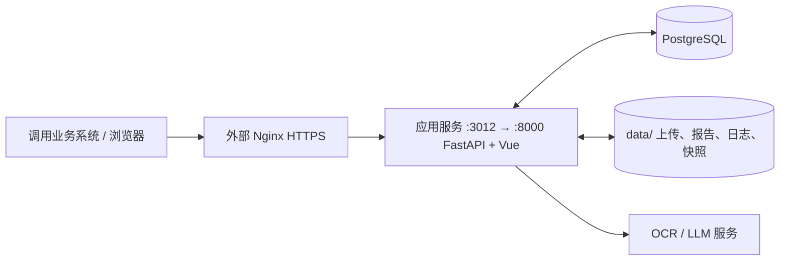

# 部署与操作手顺

本文以 Linux 单机、Docker Compose v2、单一应用服务与 PostgreSQL 为例。
发布为原地升级（排空后换镜像重建同一容器）；OCR/LLM 由管理端配置为外部服务。

## 服务关系图



发布时端口映射和外部 Nginx 不变。版本验证使用固定样本回归与人工核验。

## 1. 目录、端口和持久化边界

建议目录：

```text
/srv/document-comparison/        # 正式服务：代码、Compose、.env
/srv/document-comparison/data/   # PG、上传、报告、日志、配置快照
/srv/document-comparison/fonts/  # 可选的已授权字体
```

默认 Compose 映射如下：

| 项目 | 宿主端口 | 容器端口 | 用途 |
| --- | ---: | ---: | --- |
| 应用 | `DC_PORT`，建议 `3012` | 8000 | 唯一正式 Web、控制台、API 入口 |
| PostgreSQL | 15433 | 5432 | 仅限宿主机运维；不应对公网开放 |

`./data/pg`、`./data/uploads`、`./data/reports`、`./data/logs` 都是业务数据。
升级、重建容器、切换镜像都不能删除 `data/`。`docker compose down -v` 会删除 Docker 卷；当前项目使用绑定目录，仍不应将它作为日常发布命令。

## 2. 部署前检查

目标机需要 Linux x86_64、Docker 20.10+、Compose v2、足够的磁盘和能访问 OCR/LLM 服务的网络。
应用镜像包含 LibreOffice、PaddleOCR 依赖和开源中文字体；GPU/模型服务不在这个 Compose 中。

```bash
docker version
docker compose version
df -h /srv
```

若宿主机由 Nginx 对外提供服务，防火墙只开放 80/443；3012、15433 留给本机或受限运维网段。
上传限制默认 50MB，Nginx 的 `client_max_body_size` 应设为至少 `60m`。

## 3. 首次部署

1. 放置代码并创建环境文件。

```bash
sudo mkdir -p /srv/document-comparison
sudo chown "$USER" /srv/document-comparison
cd /srv/document-comparison
# 将已验证的项目代码放到当前目录
cp .env.example .env
chmod 600 .env
```

2. 编辑 `.env`。至少设置版本、端口、数据库口令和控制台口令。口令不要使用示例值。

```dotenv
DC_VERSION=0.0.36
COMPOSE_PROJECT_NAME=dcprod
DC_PORT=3012
POSTGRES_PASSWORD=替换为高强度随机密码
DC_CONSOLE_PASSWORD=替换为控制台口令
DC_DEPLOYMENT_ID=main
DC_DEPLOYMENT_INITIAL_MODE=SERVING
DC_DB_AUTO_MIGRATE=1
DC_UVICORN_WORKERS=1
DC_MAX_CONCURRENT_TASKS=4
```

部署 ID 固定为 `main`，跨版本复用；发布时只改 `DC_VERSION`。

生产口令可用受控密码系统生成；不要把生成结果发到终端日志、提交 Git 或写入工单。

3. 固定 Compose 项目名并首次构建启动。

```bash
docker compose config
docker compose up -d --build
docker compose ps
```

首次启动时应用会等待 PostgreSQL 健康检查，并执行 Alembic 迁移。若 `data/pg` 已存在但权限不正确，先看日志；
需要调整属主时，以 `docker run --rm --entrypoint id postgres:16-alpine postgres` 查询容器内 `postgres` 用户 UID/GID 后再处理，不要盲目递归修改整个 `/srv`。

4. 验收基础运行状态。

```bash
curl -fsS http://127.0.0.1:3012/health
curl -fsS http://127.0.0.1:3012/ready
curl -fsS http://127.0.0.1:3012/api/v1/version
docker compose logs --tail=150 llm-ocr-compare
docker compose exec llm-ocr-compare python -m document_comparison.release status
```

`/health` 返回 `{"status":"ok"}`。`/ready` 返回 HTTP 200，且 `checks.database`、`schema`、`deployment`、`uploads`、`reports`、`dispatcher` 都应为 `true`。控制台首次进入时以 `.env` 的 `DC_CONSOLE_PASSWORD` 登录，再在管理端配置 OCR/LLM 地址、模型和外部接口参数；这些模型配置持久化在 PostgreSQL 中。

## 4. Nginx 反向代理

以下配置放入已有的站点 `server` 块，域名、证书和现有安全策略由部署方替换。它永远转发到本机 3012；3012 是应用容器的稳定宿主端口，发布（原地换镜像重建容器）不会改动此 Nginx 配置、端口、防火墙或业务系统地址。SSE 进度需要关闭代理缓冲并提高读超时。

```nginx
client_max_body_size 60m;

location / {
    proxy_pass http://127.0.0.1:3012;
    proxy_http_version 1.1;
    proxy_set_header Host $host;
    proxy_set_header X-Real-IP $remote_addr;
    proxy_set_header X-Forwarded-For $proxy_add_x_forwarded_for;
    proxy_set_header X-Forwarded-Proto $scheme;
    proxy_buffering off;
    proxy_read_timeout 3600s;
    proxy_send_timeout 3600s;
}
```

检查并平滑加载：

```bash
nginx -t
nginx -s reload
```

在应用管理端把外部公开地址设置为 `https://你的域名`。它用于生成外部报告、图片和下载地址。

## 5. 日常检查、日志和备份

```bash
cd /srv/document-comparison
docker compose ps
docker compose logs -f --tail=200 llm-ocr-compare
curl -sS http://127.0.0.1:3012/ready
docker compose exec llm-ocr-compare python -m document_comparison.release status
```

备份时同时保存数据目录与逻辑数据库备份：

```bash
cd /srv/document-comparison
tar czf /srv/backup/dc-data-$(date +%F).tgz data
docker compose exec -T postgres pg_dump -U dc doc_compare > /srv/backup/dc-db-$(date +%F).sql
```

恢复应先停止应用容器，再恢复目录与数据库；恢复完成后启动并检查 `/ready`。不要用上线前的数据库备份覆盖正在承接新任务的正式库来做常规回滚。

## 6. 发布新版本（原地升级）

普通单服务升级可直接执行（先准备好新版本镜像并更新 `.env` 中的 `DC_VERSION`）：

```bash
docker compose up -d
```

启动会自动更新版本记录，原状态为 `SERVING` 时继续接单；主动维护的 `DRAINING` / `STOPPED` 状态保持不变。
源码修改后需 `docker compose up -d --build`；仅 `up -d` 不会重建已有镜像。
存在长任务时，仍建议采用下方排空发布流程，以免超过容器停止等待时间。

发布前完成测试并构建固定版本镜像。例如在构建机的项目目录执行：

```bash
docker build --platform linux/amd64 \
  --build-arg DC_VERSION=0.0.37 \
  -t registry.cn-hangzhou.aliyuncs.com/chldemo/llm-ocr-compare:0.0.37 .
# 受控镜像仓库 push
```

发布为原地升级：排空 → 换镜像 tag 重建同一容器 → 自检 → 接单。完整条件与异常处理见 [release-switch.md](release-switch.md)：

1. 完成固定样本回归、人工准确率核验、报告/API/测试回调验收和迁移演练。
2. 排空 + 快照 + 停机（任一步失败即停；超时保持 DRAINING，查看 `status` 后处理，需要取消则 `ctl serve`）：

```bash
cd /srv/document-comparison
bash scripts/release.sh prepare llm-ocr-compare before-0.0.37 1800
```

3. 排空后备份数据库与 data 目录，然后修改 `.env` 的 `DC_VERSION=0.0.37`，拉取镜像并重建。新容器启动时自动执行 `alembic upgrade head`（`DC_DB_AUTO_MIGRATE=1`），注册新版本后保持 STOPPED，不自动接单：

```bash
tar czf /srv/backup/dc-data-$(date +%F).tgz data
docker compose exec -T postgres pg_dump -U dc doc_compare > /srv/backup/dc-db-$(date +%F).sql
docker compose pull llm-ocr-compare
docker compose up -d llm-ocr-compare
```

4. 就绪自检（期望 exit 0、`prepared=true`；此时 HTTP `/ready` 503 属正常），然后恢复接单并验收：

```bash
bash scripts/release.sh ctl llm-ocr-compare ready
bash scripts/release.sh ctl llm-ocr-compare serve
curl -fsS http://127.0.0.1:3012/ready
```

5. 通过正式域名验证版本、提交、任务查询、SSE、报告、下载和测试回调。从停机到 serve 的窗口约 1-3 分钟，写请求返回 503 + `Retry-After`；不要用真实单据向正式回调接收端做发布测试。

## 7. 回滚

**serve 之前发现问题**（未接单，无业务写入）：`.env` 的 `DC_VERSION` 改回旧版本，`docker compose up -d llm-ocr-compare` 后 `ctl serve` 即可；外部 Nginx 不需要改动。

**serve 之后发现问题**（已接单）：先对新版本再走一次 `prepare`（drain → wait → snapshot → stop），核对任务、报告和回调；`.env` 改回旧版本后 `up -d` 重建，若新版本改过 llm_config 语义先恢复快照，最后 `ctl serve`：

```bash
bash scripts/release.sh prepare llm-ocr-compare rollback-0.0.37 1800
docker compose up -d llm-ocr-compare
bash scripts/release.sh ctl llm-ocr-compare serve
```

不要跳过排空，也不要让两个版本同时接单（注册层会拒绝）。旧配置快照的恢复在全库排空后执行，快照路径与 SHA256 来自 prepare 的输出：

```bash
bash scripts/release.sh ctl llm-ocr-compare restore \
  --file /app/.dc_data/release-snapshots/SNAPSHOT_ID.json \
  --sha256 SNAPSHOT_SHA256 \
  --source-deployment main
```

**降级兼容性**：迁移在新容器启动时先行执行，若迁移包含不向后兼容的 schema 变更，旧镜像可能无法在新 schema 上运行——此类发布前必须确认迁移可逆或接受不可回滚窗口。

若发现未知的 `release_activities`，先确认相应 worker 已停止，核对任务/文件/回调，再用 `resolve-activity` 清除该操作屏障。它不是自动清理工具。

## 8. 从旧双服务验证部署升级

旧部署应先停止独立影子分发器，再停止 B 验证应用；根据旧 Compose 项目名定位容器，
不要停止正式应用或删除数据目录。随后按上述单服务流程升级正式应用。
旧 `DC_SHADOW_*` 环境变量已不再使用，控制台质量对照入口与相关 API 已移除。
历史 `0014_shadow_comparisons` 迁移和表结构保留，仅用于已有数据库升级兼容及历史数据留存，应用不再读写该表。
本次代码调整不会自动停止已部署的容器，也不会删除历史验证数据。
