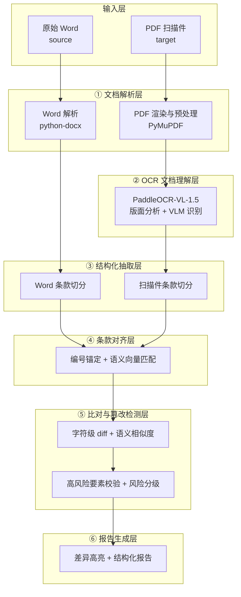

# 文档比对系统技术方案
## 基于 PaddleOCR-VL-1.5 的合同条款篡改检测

> 版本：v0.1（草案）　日期：2026-06-30　状态：技术方案评审中

---

## 1. 项目背景与目标

### 1.1 业务背景

在合同签署与归档场景中，存在一类典型风险：**甲方提供的原始 Word 版合同，与最终回收盖章的 PDF 扫描件之间，条款内容被暗中篡改**（金额、日期、违约责任、争议解决方式、管辖法院等关键条款）。人工逐字比对成本高、易遗漏，尤其在长合同（数十页）和批量场景下问题突出。

本项目构建一套自动化比对系统：以**原始 Word 文档**为基准，以 **PDF 扫描件**为待核对象，自动检测两者在条款层面是否存在实质性差异，并输出结构化的篡改风险报告。

### 1.2 核心目标

| 目标 | 说明 |
| --- | --- |
| 高保真还原扫描件 | 用 PaddleOCR-VL-1.5 把扫描 PDF 精准解析为结构化文本（含表格/印章），还原率对标 OmniDocBench v1.5 精度（94.5%） |
| 条款级对齐 | 把 Word 与扫描件都拆成条款（第一条 / 1.1 / (1)…），建立一一对应关系 |
| 实质差异识别 | 区分「OCR 噪声 / 格式差异」与「实质性篡改」，降低误报 |
| 关键要素强校验 | 金额、日期、比例、违约责任、管辖法院等高风险要素任何变化必报 |
| 可视化报告 | 在 PDF 页面上高亮差异位置，输出可复核的比对报告 |

### 1.3 非目标（本期不做）

- 不做合同条款的「法律合规性 / 风险条款审查」（那是法律审查，不是篡改检测）。
- 不做跨语言合同比对（本期聚焦中文合同，模型支持 109 语种但比对逻辑针对中文）。
- 不做手写批注 / 涂改的语义识别（仅识别其存在并标记需人工复核）。

---

## 2. 核心概念与术语

| 术语 | 含义 |
| --- | --- |
| 基准件（source） | 原始 Word 合同，作为比对的「正确」基准 |
| 待核件（target） | PDF 扫描件（盖章回收件），待检测是否被篡改 |
| 文档单元（block） | PaddleOCR-VL 输出的版面元素，如 text / table / title / seal 等，带 bbox |
| 条款（clause） | 比对的基本粒度，按编号层级切分（第一条、1.1、(1)）形成的逻辑单元 |
| 对齐（alignment） | 把基准件条款与待核件条款建立对应关系的过程 |
| 差异（diff） | 一对对齐条款间的变化，分 identical / modified / added / deleted |
| 高风险要素 | 金额、日期、比例、期限、违约责任、争议解决、管辖法院、生效条件等 |
| 篡改（tamper） | 待核件相对基准件的**实质性、非格式性**条款变化 |

---

## 3. 系统总体架构

系统采用分层、流水线（pipeline）架构，从原始文件到比对报告共六层：



### 3.1 PaddleOCR-VL-1.5 在系统中的定位

PaddleOCR-VL-1.5 是系统的**核心引擎，仅用于第②层「PDF 扫描件 → 结构化文本」**，即把扫描件变成可与 Word 对齐的文本+版面+表格结构。它不负责比对逻辑本身。这样设计的好处是：OCR 引擎可独立升级（如切换到 1.6），比对层不受影响。

PaddleOCR-VL-1.5 关键能力（来自官方文档，2026-01-29 发布）：

- **两阶段架构**：版面分析（PP-DocLayoutV2）检测并定位各类版面元素、确定阅读顺序 → VLM 识别（ERNIE-4.5-0.3B，0.9B 参数）对每个元素子图生成识别结果（Markdown），再按顺序合并。
- **精度**：OmniDocBench v1.5 达 94.5%，文本/表格/公式识别全面领先。
- **场景鲁棒**：扫描、倾斜、弯折、屏幕拍摄、复杂光照均表现优异。
- **1.5 新增**：异形框定位（`layout_shape_mode` 支持 rect/quad/poly/auto）、**印章识别**（`use_seal_recognition`）、文本检测识别（spotting）。
- **多页处理**：`restructure_pages()` 支持跨页表格合并、多级标题重建、多页结果拼接。
- **输出**：结构化 JSON（含 `layout_det_res.boxes` 的 label/score/coordinate）、Markdown、Word。

> 注意：必须使用「版面分析 + VLM」**完整流程**（即 `use_layout_detection=True`），单独跑 VLM 组件会出现幻觉文本、无法复现精度。

---

## 4. 技术选型

| 层 | 选型 | 理由 |
| --- | --- | --- |
| Word 解析 | `python-docx` | 直接读取段落、表格、标题样式，保留结构，纯文本无损 |
| PDF 渲染 | `PyMuPDF`（fitz） | 高速渲染页面为图像，支持指定 DPI |
| 图像预处理 | PaddleOCR-VL 内置（方向分类 / 矫正） | 1.5 内置 `use_doc_orientation_classify`、`use_doc_unwarping`，扫描件倾斜/弯曲自动处理 |
| OCR 引擎 | **PaddleOCR-VL-1.5** | 扫描合同场景 SOTA，表格/印章识别强 |
| 文本归一化 | 自研规则 + `opencc` / 全半角处理 | 统一全半角、标点、空白，消除格式噪声 |
| 语义向量 | `bge-m3`（或 `m3e-base`） | 中文条款语义匹配，对齐兜底 |
| 字符级 diff | `difflib` + 自研 token 对齐 | 定位精确改动位置 |
| 模糊判决（可选） | LLM（如 ERNIE / GPT 类） | 处理语义相似度边界、判断是否实质改变义务/权利 |
| 报告 | `reportlab` / `PyMuPDF` 批注 + JSON | PDF 高亮 + 结构化报告双输出 |
| 服务 | FastAPI | 轻量 HTTP 接口，便于集成 |
| 部署 | Docker + VLM 推理服务 | 官方推荐生产用 VLM 推理服务（vLLM/SGLang/FastDeploy） |

### 4.1 PaddleOCR-VL-1.5 关键参数配置

```python
from paddleocr import PaddleOCRVL

pipeline = PaddleOCRVL(
    pipeline_version="v1.5",          # 锁定 1.5
    use_doc_orientation_classify=True, # 扫描件方向自动校正
    use_doc_unwarping=True,            # 弯折/透视矫正
    use_layout_detection=True,         # 必须开启，否则丢精度
    use_seal_recognition=True,         # 印章识别（合同必备）
    use_chart_recognition=False,       # 合同一般无图表
    layout_shape_mode="auto",          # 异形框定位（1.5 新增）
    format_block_content=True,         # block 输出 Markdown
)
```

多页 PDF 用 `restructure_pages` 重建结构：

```python
pages_res = list(pipeline.predict(input="./contract_scan.pdf"))
output = pipeline.restructure_pages(
    pages_res,
    merge_tables=True,      # 合并跨页表格（合同附表常跨页）
    relevel_titles=True,    # 重建多级标题层级
    concatenate_pages=True, # 拼成单文档
)
```

---

## 5. 核心流程设计

### 5.1 ① 文档解析层

**Word（基准件）**：用 `python-docx` 顺序遍历 body，区分段落与表格，保留：
- 段落文本 + 样式（Heading1/2… 用于判定标题层级）
- 表格 → 转为行列文本矩阵
- 段落顺序（文档流顺序即阅读顺序）

**PDF（待核件）**：用 PyMuPDF 按 300 DPI 渲染每页为图像，交给第②层。先做轻量预检（页数、是否含可选文本层）；若含可选文本层，仅作为交叉校验参考，不作为主结果（扫描件文本层常不可靠）。

### 5.2 ② OCR 文档理解层（PaddleOCR-VL-1.5）

对每页图像调用 PaddleOCR-VL-1.5，得到：
- 版面元素列表：每个 block 带 `label`（doc_title / text / table / paragraph_title / seal…）、`score`、`coordinate`（bbox）。
- 每个 block 的识别文本（Markdown，表格为 Markdown 表格）。
- 经 `restructure_pages` 后得到整篇结构化结果。

> 印章（seal）区域单独识别：合同篡改常伴随「换页重盖」「遮挡关键文字」等手法，印章位置/数量变化本身即为风险信号。

### 5.3 ③ 结构化抽取层（条款切分）

两端都做同样的条款切分，得到统一的 `Clause` 列表：

1. **文本归一化**：全半角统一、标点统一、去除多余空白、页眉页脚过滤。
2. **编号识别**：用正则识别中文合同常见编号层级：
   - 第 X 条 / 第 X 章
   - X.X / X.X.X（阿拉伯数字层级）
   - (X) / （X）/ 1） 等括号序号
   - 一、二、 / 1. 2. 等
3. **层级重建**：按编号层级构建条款树（条 → 款 → 项）。
4. **标题归属**：`paragraph_title` / Heading 作为条款标题，后续正文归入该条款。
5. **表格归属**：表格归入其前最近的条款（如附表归对应条）。

输出统一 `Clause`：`{id, level, number, title, text, blocks[]}`。

### 5.4 ④ 条款对齐层

目标：基准件条款集 A 与待核件条款集 B 建立一一（或一空）对应。

采用**三层兜底策略**：

1. **编号锚定（首选）**：按条款编号精确匹配。合同篡改通常改内容不改编号，编号是最强锚点。编号相同的条款直接配对。
2. **语义向量匹配（兜底）**：对未配对的条款（编号缺失/OCR 识别错编号），用 `bge-m3` 计算条款文本向量，做最近邻匹配，相似度阈值（如 ≥ 0.85）才确认配对。
3. **人工复核标记**：仍无法配对的，标记为 `added`（待核件多出）/ `deleted`（待核件缺失），进入报告供人工复核。

> 顺序敏感：合同条款顺序稳定，向量匹配时在「编号邻域」内优先搜索，避免远距离误配。

### 5.5 ⑤ 比对与篡改检测层

对每一对配对条款，做多维比对：

| 维度 | 方法 | 用途 |
| --- | --- | --- |
| 字符级 diff | `difflib` token 对齐 | 精确定位增删改片段 |
| 语义相似度 | 向量余弦 | 判断是否实质改变 |
| 高风险要素抽取 | 规则正则 + 词典 | 抽取金额/日期/比例/期限等 |
| 要素比对 | 抽取出的要素逐项对比 | 关键要素变化必报 |

**篡改判定逻辑**（核心）：

- 归一化后字符完全一致 → `identical`（无差异）。
- 仅有空白/标点/全半角差异 → 判为格式噪声，`identical`（降误报）。
- 语义相似度 ≥ 高阈值（如 0.98）且无高风险要素变化 → 判为 `OCR 噪声`，标记低风险，不报篡改。
- 语义相似度下降 **或** 高风险要素变化 → 判为 `modified`，按风险分级报告。
- 任一方独有条款 → `added` / `deleted`，高风险。

### 5.6 ⑥ 报告生成层

差异的呈现采用「**前端交互渲染为主，后端烧录 PDF 为辅**」双产物设计：

1. **结构化报告（JSON）**：报告页前端据此渲染（见 §13），包含：
   - 总览：差异条款数、风险等级分布、高风险要素变更清单。
   - 逐条款：对齐状态、差异片段（红删绿增）、风险等级、风险原因。
   - **坐标数据**：每个 diff 关联其在 PDF 扫描件上的页码与归一化 bbox（见下），供前端叠加高亮。
2. **PDF 高亮报告（离线产物）**：用 PyMuPDF 把高亮/红黄标记烧录进扫描件 PDF，作为可下载、可离线归档的复核件。

> 两者并存：前端交互渲染负责在线审查体验（条款-PDF 联动），烧录 PDF 负责离线归档与留痕。

**bbox 坐标归一化（关键）**：第②层 PyMuPDF 以 300 DPI 渲染图像交 OCR，OCR 返回的 bbox 为像素坐标；前端 pdf.js 的 viewport 基于 PDF 原生坐标系（72 DPI 点），两者不直接兼容。因此报告层输出 bbox 时**统一归一化为页面相对坐标 `[0,1]`**（`bbox_x / page_width_px`，异形框 poly 同理），并附每页像素尺寸。前端乘以 pdf.js 当前渲染尺寸即可定位，与 DPI、缩放级别完全解耦。

---

## 6. 数据结构设计

```python
# 版面元素（PaddleOCR-VL 输出归一化）
class Block:
    block_id: str
    page_index: int
    label: str          # text / table / doc_title / paragraph_title / seal ...
    bbox: list[float]   # [x1, y1, x2, y2] 或 quad/poly
    content: str        # Markdown 文本

# 条款（两端统一结构）
class Clause:
    clause_id: str
    doc_type: str       # "word" | "pdf"
    level: int          # 层级深度
    number: str         # 编号，如 "第三条" / "1.1"
    title: str
    text: str
    blocks: list[Block]

# 对齐结果
class Alignment:
    word_clause_id: str | None
    pdf_clause_id: str | None
    match_type: str     # number / semantic / unmatched
    similarity: float

# 单条款差异
class Diff:
    alignment_id: str
    status: str         # identical / modified / added / deleted
    segments: list      # 字符级 diff 片段
    risk_level: str     # high / medium / low / none
    risk_reasons: list[str]
    page_regions: list[PageRegion]  # 该条款在 PDF 扫描件上的高亮区域（归一化坐标）

# PDF 页面区域（归一化坐标，供前端高亮叠加）
class PageRegion:
    page_index: int            # 0-based 页码
    bbox: list[float]          # 归一化 [x1, y1, x2, y2]，相对页面尺寸 ∈ [0,1]
    shape: str                 # rect / quad / poly（异形框）
    polygon: list[list[float]] | None  # quad/poly 的归一化顶点（shape != rect 时）

# 高风险要素
class KeyElement:
    kind: str           # amount / date / ratio / term / court ...
    word_value: str
    pdf_value: str
    changed: bool

# 比对报告
class TamperReport:
    source: str
    target: str
    overall_risk: str           # high / medium / low / clean
    summary: dict               # 统计
    diffs: list[Diff]
    key_elements: list[KeyElement]
    unmatched_clauses: list     # added / deleted
    page_meta: list[PageMeta]   # 每页尺寸（供前端坐标反算与 pdf.js viewport 对齐）

# 页面元信息
class PageMeta:
    page_index: int
    width_px: float             # OCR 渲染时的像素宽度（300 DPI）
    height_px: float            # OCR 渲染时的像素高度（300 DPI）
    pdf_width_pt: float         # PDF 原生宽度（点，1/72 inch），供 pdf.js viewport
```

---

## 7. API 设计（FastAPI）

> 前后端分离部署，必须配置 CORS（允许前端域名）。
> **认证**：所有端点要求请求头携带 `X-API-Key`（对外集成见 §14）；前端 SPA 作为内部调用方，走内部 Key 或单独会话通道。FastAPI 用依赖注入统一校验。

### 7.1 提交比对任务

```
POST /api/v1/compare
Content-Type: multipart/form-data
X-API-Key: <key>

form:
  source: file           # 原始 Word
  target: file           # PDF 扫描件
  options: json          # 可选：相似度阈值、是否启用 LLM 判决等
  callback_url: str      # 可选：Webhook 回调地址，任务完成后 POST 结果摘要（见 §14.3）
  callback_secret: str   # 可选：Webhook 签名密钥，用于校验 X-Signature
```

返回 `task_id`，异步处理（OCR 耗时较长）。调用方可任选一种取结果方式：轮询 §7.2、SSE §7.3、或 Webhook 回调 §14.3。

### 7.2 查询结果

```
GET /api/v1/compare/{task_id}
```

返回 `TamperReport`，含状态（pending/running/done/failed）与报告内容。`diffs[].page_regions` 与 `page_meta` 提供前端高亮所需的归一化坐标（见 §6）。

### 7.3 任务进度（SSE，优先于轮询）

OCR 耗时长，前端默认用 Server-Sent Events 推送进度，避免高频轮询 7.2：

```
GET /api/v1/compare/{task_id}/events
Content-Type: text/event-stream

event: progress
data: {"stage": "ocr", "page": 12, "total": 30}

event: done
data: {"task_id": "...", "overall_risk": "high"}
```

阶段取值：`parsing` / `ocr` / `aligning` / `comparing` / `reporting`。前端收到 `done`/`failed` 后拉取 7.2 取完整报告。无 SSE 客户端时降级为轮询 7.2。

### 7.4 下载报告

```
GET /api/v1/compare/{task_id}/report?format=pdf|json
```

`pdf` 为烧录高亮的离线报告（见 §5.6），`json` 为结构化报告。

---

## 8. 篡改检测策略

### 8.1 高风险要素清单（任一变化必报）

| 类别 | 识别方式 | 风险 |
| --- | --- | --- |
| 金额 | `￥/¥/元/万` + 数字、大写金额（壹贰叁…） | 极高 |
| 日期/期限 | `YYYY-MM-DD`、`X 年 X 月`、`X 个工作日` | 极高 |
| 比例 | `X%`、`百分之 X` | 高 |
| 违约责任 | 含「违约/赔偿/滞纳金/罚息」条款 | 高 |
| 争议解决/管辖 | 含「诉讼/仲裁/管辖/法院」条款 | 高 |
| 生效/解除条件 | 含「生效/解除/终止」条款 | 高 |
| 签章 | 印章数量/位置变化（来自 seal 识别） | 高 |

### 8.2 常见篡改手法与对应检测

| 篡改手法 | 检测方式 |
| --- | --- |
| 改金额/日期/比例 | 高风险要素比对，必报 |
| 增删整个条款 | 条款对齐层识别 added/deleted |
| 换页重盖（关键页被替换） | 印章位置/数量变化 + 该页条款与基准差异 |
| 微小字体插入/白色字 | 版面 bbox 异常（极小区域）+ 文本对齐异常 |
| 调整条款顺序 | 编号锚定失效 → 语义匹配 → 顺序漂移标记 |
| 同义替换规避 | 语义相似度下降 + LLM 判决是否实质改变义务 |

### 8.3 风险分级

- **high**：高风险要素变化、条款增删、签章异常。
- **medium**：非要素条款实质性修改（语义相似度显著下降）。
- **low**：疑似 OCR 噪声但相似度略低，提示人工抽检。
- **none**：一致或纯格式差异。

`overall_risk` 取所有条款最高风险等级。

---

## 9. 关键技术难点与解决方案

### 9.1 区分 OCR 误差与真实篡改（最难）

扫描件 OCR 不可避免有字符级误差，若直接字符 diff 会产生海量误报。

**对策**：
1. 文本归一化先行，消除格式噪声。
2. 用语义相似度而非字面一致判断「是否实质改变」。
3. 设双阈值：相似度 ≥ 0.98 视为一致；0.85–0.98 视为疑似（结合字符 diff 看是否仅个别字符）；< 0.85 视为实质修改。
4. 高风险要素单独严格比对（金额/日期不依赖相似度，逐字符校验）。

### 9.2 跨页表格与附表对齐

合同附表（如付款计划表）常跨页，Word 中是一个表格，扫描件被切成多页。

**对策**：PaddleOCR-VL 的 `restructure_pages(merge_tables=True)` 合并跨页表格；比对时按表格行列矩阵整体比对，而非拆散。

### 9.3 条款编号被 OCR 识别错

编号「第三条」可能被识别成「第三杀」「筹三条」等。

**对策**：编号锚定失败时回退语义向量匹配；并对编号做模糊纠正（中文数字与阿拉伯数字互转、形近字容错）。

### 9.4 印章遮挡文字

盖章常压在正文上，遮挡下方文字导致 OCR 漏识。

**对策**：`use_seal_recognition` 先识别印章区域，记录遮挡 bbox；该区域若落在某条款内，标记「该条款部分内容被印章遮挡，需人工核验」，不直接判篡改。

### 9.5 性能（长合同几十页）

PaddleOCR-VL 默认本地推理较慢。

**对策**：生产部署用 VLM 推理服务（vLLM/SGLang/FastDeploy），开启 `use_queues` 异步流水线（渲染/版面/VLM 三线程并行）；多文件批量传入 `predict` 提升吞吐。

---

## 10. 准确性评估

建立标注测试集（≥ 50 对合同，含已知篡改样本），分指标评估：

| 指标 | 定义 | 目标 |
| --- | --- | --- |
| OCR 还原率 | 扫描件文本与基准正确文本的字准确率 | ≥ 98%（借助 1.5 的 94.5% 版面精度） |
| 对齐准确率 | 条款正确配对比例 | ≥ 95% |
| 篡改召回率 | 真实篡改被报出的比例 | ≥ 95%（宁误报不漏报） |
| 误报率 | 一致条款被判篡改的比例 | ≤ 10% |
| 高风险要素召回 | 金额/日期等变化召回 | 100%（强校验） |

评估方式：人工标注 ground truth diff，自动比对系统输出，计算上述指标并迭代阈值。

---

## 11. 性能与部署

### 11.1 推理后端

| 方式 | 适用 | 说明 |
| --- | --- | --- |
| PaddlePaddle 本地 | 开发/小批量 | 简单，但 VLM 慢 |
| PaddlePaddle + vLLM | 生产（NVIDIA GPU） | 推荐，高吞吐 |
| Docker 官方镜像 | 标准部署 | 含飞桨框架，离线镜像可选 |

环境：Python 3.9–3.13，PaddlePaddle ≥ 3.2.1，`pip install -U "paddleocr[doc-parser]"`。NVIDIA GPU 需 CC ≥ 7.0。

### 11.2 部署形态

- OCR 服务（PaddleOCR-VL + VLM 推理服务）独立部署，供比对服务调用。
- 比对服务（FastAPI）无状态，可水平扩展。
- 任务异步化（任务队列），PDF 解析耗时不可同步等待。
- 对外暴露走 HTTPS；可选 API 网关前置，统一承载 API Key 校验、限流、Webhook 签名（见 §14）。

---

## 12. 项目里程碑

| 阶段 | 交付 | 预估 |
| --- | --- | --- |
| M1 环境与基线 | PaddleOCR-VL-1.5 跑通扫描合同，输出结构化结果 | 1 周 |
| M2 解析与切分 | Word 解析 + 双端条款切分 + 对齐 | 2 周 |
| M3 比对引擎 | diff + 高风险要素 + 风险分级 | 2 周 |
| M4 报告与服务 | PDF 高亮报告 + FastAPI + 异步任务 + 对外 API（API Key 认证、Webhook 回调、限流、OpenAPI 文档、统一错误规范，见 §14） | 2.5 周 |
| M5 评估与调优 | 标注测试集 + 阈值调优 + 误报收敛 | 2 周 |

---

## 13. 前端实现方案

### 13.1 是否引入框架：引入

差异高亮走「前端交互渲染」路径（pdf.js + bbox 叠加 + 条款联动），叠加字符级 diff、风险筛选等交互，属于有状态单页应用（SPA）。用原生 JS 维护成本高，**引入前端框架**。团队具备前端能力，框架选型服从团队既有经验。

### 13.2 技术栈

| 维度 | 选型 | 说明 |
| --- | --- | --- |
| 框架 | **Vue 3**（组合式 API） | 中型 SPA，响应式适合高亮层更新；团队 React 经验更厚则用 React |
| 构建 | Vite | 快，Vue 官方推荐 |
| 语言 | TypeScript | 与 §6 后端数据结构对齐 |
| 状态 | Pinia | `task` / `report` 两个 store |
| PDF 渲染 | `pdfjs-dist`（pdf.js） | canvas 渲染 + 上层叠加高亮 |
| diff 展示 | `diff2html` 或基于后端 segments 自渲染 | 红删绿增 |
| UI 组件 | Naive UI / Element Plus | 企业工具风格 |
| 任务状态 | SSE（§7.3）优先 / 轮询兜底 | OCR 耗时长 |

### 13.3 核心工程点：PDF 高亮坐标对齐

- 后端归一化 bbox 为页面相对坐标 `[0,1]`（见 §5.6），前端无需关心 300 DPI 与 72 DPI 的换算。
- 渲染结构：pdf.js 把页渲染到 `<canvas>` → 同尺寸绝对定位的 `<div>` 叠加层 → 按 `PageRegion` 放置高亮元素，`width/height/top/left` 取归一化值 × 当前渲染尺寸。
- 缩放/翻页时高亮随 viewport 重算，不漂移。

### 13.4 页面与组件

两个主视图：

- **提交页**：双文件上传 → `POST /api/v1/compare`，提交后跳转报告页，SSE 展示进度（解析/OCR/对齐/比对）。
- **报告页**（核心，双面板联动）：

```
┌─────────────────────────────────────────────────┐
│ 顶栏：overall_risk · 差异数 · 高风险要素清单       │
├──────────────────────┬──────────────────────────┤
│ 左：ClauseList        │ 右：PdfViewer            │
│  - 风险分级筛选       │  - pdf.js 渲染扫描件     │
│  - 条款树（展开折叠） │  - bbox 高亮叠加层       │
│  - diff 状态色        │  - 点条款→定位+高亮      │
│  - 点击→联动右侧      │  - 点高亮→选中条款       │
├──────────────────────┴──────────────────────────┤
│ 底：DiffView 字符级 diff（红删绿增）              │
│     + KeyElementTable 高风险要素 word vs pdf 对比 │
└─────────────────────────────────────────────────┘
```

| 组件 | 职责 |
| --- | --- |
| `PdfViewer` | pdf.js 加载/渲染、viewport 管理、高亮叠加层、滚动定位 |
| `ClauseList` | 条款树、风险筛选、diff 状态标记、联动选中 |
| `DiffView` | 字符级 diff 片段渲染（红删绿增） |
| `KeyElementTable` | 金额/日期/比例等高风险要素对比 |
| `RiskOverview` | 总览统计、风险分布 |

联动逻辑放在 `report` store：维护 `selectedClauseId`，`ClauseList` 点击设值 → `PdfViewer` watch 定位；反向 PDF 高亮点击同样设值 → `ClauseList` 滚动到对应项。

### 13.5 目录结构

```
web/
├── src/
│   ├── views/            # 提交页 / 报告页
│   ├── components/       # PdfViewer / ClauseList / DiffView / KeyElementTable / RiskOverview
│   ├── stores/           # task.ts / report.ts（Pinia）
│   ├── api/              # 封装 §7 接口
│   ├── types/            # 对应 §6 Block/Clause/Diff/TamperReport/PageRegion
│   ├── utils/            # bbox 坐标转换、diff 渲染辅助
│   └── App.vue / main.ts
├── vite.config.ts
└── package.json
```

## 14. 对外 API 与系统集成

除自带前端（§13）外，系统以 **HTTP REST API** 形态把「文档比对」能力对外暴露，供 OA、合同管理系统、ERP 等集成调用。核心比对端点（§7.1–7.4）前端与外部共用；对外集成的增量是认证、回调、限流、文档与安全。

### 14.1 认证：API Key

- 调用方在请求头携带 `X-API-Key: <key>`，FastAPI 依赖注入统一校验。
- Key 与调用方（tenant）关联，用于计量、限流与归属追溯。
- 存储：哈希存储（不存明文），Key 不落访问日志。
- 签发/吊销/轮换经**管理后台或运维脚本**完成，本期不设计管理端点。

### 14.2 结果获取：异步轮询 / SSE / Webhook

OCR 耗时长，统一异步：提交（§7.1）拿 `task_id` 后，调用方可任选：
- **轮询** `GET /api/v1/compare/{task_id}`（§7.2）
- **SSE** 实时进度 `GET /api/v1/compare/{task_id}/events`（§7.3）
- **Webhook 回调**（§14.3，适合不想轮询的调用方）

### 14.3 Webhook 回调

- **触发**：任务 `done` / `failed` 时，服务端 `POST {callback_url}`。
- **Body**：结果摘要（`overall_risk`、差异计数、高风险要素清单）+ 报告下载链接（带短期签名令牌控权）。**不推完整 `TamperReport`**，避免体过大。
- **签名**：`X-Signature = HMAC-SHA256(callback_secret, raw_body)`，调用方校验防伪造。
- **幂等**：每事件带唯一 `event_id`，调用方可去重。
- **重试**：失败按指数退避重试（如 3 次：30s / 2m / 10m）；最终失败留存，可由管理端手动重推。

### 14.4 限流与配额

- 按 API Key 令牌桶限流（如每分钟 N 次提交），超限返回 `429`。
- 并发任务上限（OCR 资源重，防耗尽），超额排队或拒绝。

### 14.5 API 文档与版本

- FastAPI 自动生成 OpenAPI 3.0：`/docs`（Swagger UI）、`/redoc`，对外发布。
- 版本前缀 `/api/v1/`，破坏性变更升 `/api/v2/`，旧版保留过渡期。
- **统一错误响应**：`{code, message, request_id}`，`request_id` 贯穿日志便于排障。

### 14.6 安全与合规

- 对外强制 HTTPS；可选 API 网关前置，统一限流与签名校验。
- 合同文件加密存储，设留存期 / 用后即删；访问日志脱敏（不记录文件内容）。
- API Key 最小权限原则。

### 14.7 对外 API 端点总览

| 方法 | 路径 | 用途 | 认证 |
| --- | --- | --- | --- |
| POST | `/api/v1/compare` | 提交（可选 `callback_url`/`callback_secret`） | API Key |
| GET | `/api/v1/compare/{task_id}` | 查询结果 | API Key |
| GET | `/api/v1/compare/{task_id}/events` | SSE 进度 | API Key |
| GET | `/api/v1/compare/{task_id}/report?format=pdf\|json` | 下载报告 | API Key |

---

## 附录 A：PaddleOCR-VL-1.5 速查

- 发布：2026-01-29，OmniDocBench v1.5 精度 94.5%。
- 架构：版面分析（PP-DocLayoutV2）+ VLM 识别（ERNIE-4.5-0.3B，0.9B）。
- 1.5 新增：异形框定位（`layout_shape_mode`）、印章识别（`use_seal_recognition`）、文本检测（spotting）。
- 调用：`PaddleOCRVL(pipeline_version="v1.5").predict(...)`，多页用 `restructure_pages(...)`。
- 输出：`save_to_json / save_to_markdown / save_to_word`；结构含 `layout_det_res.boxes`（label/score/coordinate）。
- 官方文档：`docs/version3.x/pipeline_usage/PaddleOCR-VL.md`（PaddleOCR 仓库）。

> 说明：1.6 已于 2026-05-28 发布（96.3%），与 1.5 结构一致、可零成本迁移；本期锁定 1.5，后续可平滑升级。
