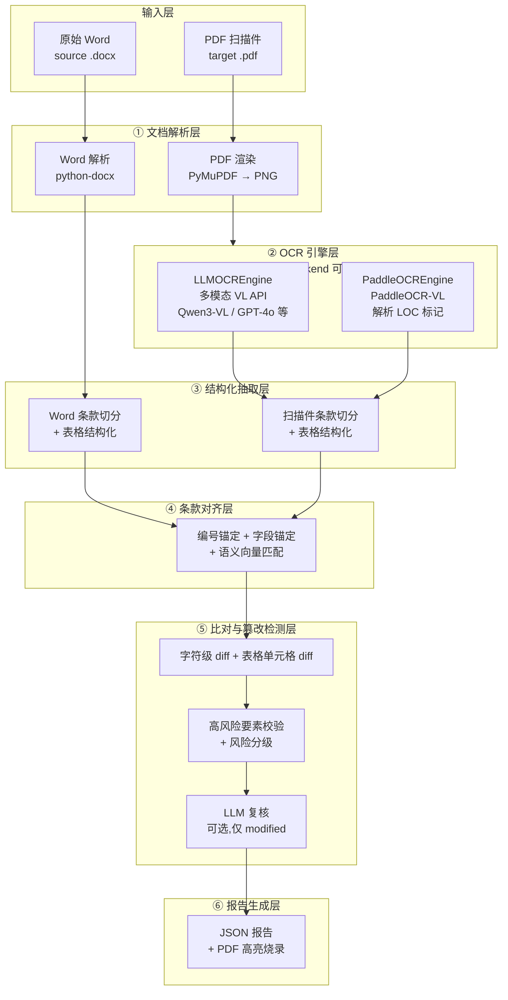

# 文档比对系统技术方案
## 合同条款篡改检测

> 版本：v0.9（对齐实际实现）　日期：2026-07-14

---

## 1. 项目背景与目标

### 1.1 业务背景

在合同签署与归档场景中，存在一类典型风险：**甲方提供的原始 Word 版合同，与最终回收盖章的 PDF 扫描件之间，条款内容被暗中篡改**（金额、日期、违约责任、争议解决方式、管辖法院等关键条款）。人工逐字比对成本高、易遗漏，尤其在长合同（数十页）和批量场景下问题突出。

本项目构建一套自动化比对系统：以**原始 Word 文档**为基准，以 **PDF 扫描件**为待核对象，自动检测两者在条款层面是否存在实质性差异，并输出结构化的篡改风险报告。

### 1.2 核心目标

| 目标 | 说明 |
| --- | --- |
| 高保真还原扫描件 | 通过 OpenAI 兼容多模态 API（云端 VL 模型或 PaddleOCR-VL）把扫描 PDF 解析为结构化文本 |
| 条款级对齐 | 把 Word 与扫描件都拆成条款（第一条 / 1.1 / (1)…），建立对应关系 |
| 实质差异识别 | 区分「OCR 噪声 / 格式差异」与「实质性篡改」，降低误报 |
| 关键要素强校验 | 金额、日期、比例、违约责任、管辖法院等高风险要素任何变化必报 |
| 表格单元格级比对 | 结构化表格按行列对齐，定位到具体单元格的要素篡改 |
| LLM 复核（可选） | 规则初筛后，对疑似修改条款调 LLM 语义复核，可升级或降级风险 |
| 可视化报告 | 在 PDF 页面上高亮差异位置，输出可复核的比对报告 |

### 1.3 非目标

- 不做合同条款的「法律合规性 / 风险条款审查」（那是法律审查，不是篡改检测）。
- 不做跨语言合同比对（聚焦中文合同）。
- 不做手写批注 / 涂改的语义识别。

---

## 2. 核心概念与术语

| 术语 | 含义 |
| --- | --- |
| 基准件（source） | 原始 Word 合同，作为比对的「正确」基准 |
| 待核件（target） | PDF 扫描件（盖章回收件），待检测是否被篡改 |
| 文档块（Block） | OCR 输出的版面元素，如 text / table / title 等，带 bbox |
| 表格结构（TableStructure） | 结构化表格的表头+数据行，用于单元格级比对 |
| 条款（Clause） | 比对的基本粒度，按编号层级切分（第一条、1.1、(1)）形成的逻辑单元 |
| 对齐（Alignment） | 把基准件条款与待核件条款建立对应关系的过程 |
| 差异（Diff） | 一对对齐条款间的变化，分 identical / modified / added / deleted |
| 高风险要素 | 金额、日期、比例、期限、违约责任、争议解决、管辖法院、生效条件等 |
| 篡改（tamper） | 待核件相对基准件的**实质性、非格式性**条款变化 |

---

## 3. 系统总体架构

系统采用分层、流水线（pipeline）架构。OCR 层支持双引擎切换（多模态 LLM API 或 PaddleOCR-VL），均可通过 OpenAI 兼容协议调用，无需本地 GPU。



### 3.1 OCR 引擎可切换设计

系统通过 `ocr_backend` 配置项在两个 OCR 引擎间切换，两者都实现 `OCREngine` Protocol（`ocr/base.py`），上层 pipeline 无感知：

| 引擎 | 配置值 | 模型示例 | 输出格式 | 适用场景 |
| --- | --- | --- | --- | --- |
| **LLMOCREngine** | `llm`（默认） | Qwen3-VL-32B-Instruct、GPT-4o | JSON `{blocks:[...]}` | 通用，遵循格式指令，支持表格结构化 |
| **PaddleOCREngine** | `paddleocr` | PaddleOCR-VL-1.5 | `文字行 + <|LOC_|>` 坐标标记 | 内网/隐私场景，像素级精确 bbox |

两个引擎都走 OpenAI 兼容 `/chat/completions` 协议（逐页 base64 图片），配置独立：
- `llm` → `llm_api_base` / `llm_api_key` / `llm_model`
- `paddleocr` → `paddleocr_api_base` / `paddleocr_api_key` / `paddleocr_model`

> **重要**：SiliconFlow 等 API 平台上的 PaddleOCR-VL 是**专用 OCR 模型，不遵循 system prompt 格式指令**，固定返回 `文字行 + <|LOC_xxx|>` 坐标标记格式。`PaddleOCREngine` 专门解析此格式（LOC 坐标 0-1000 归一化空间 → PDF pt）。**不能**用 `LLMOCREngine` 跑 PaddleOCR-VL（会返回非 blocks 结构导致 0 blocks）。

---

## 4. 技术选型

| 层 | 选型 | 理由 |
| --- | --- | --- |
| Word 解析 | `python-docx` ≥ 1.1 | 直接读取段落、表格、标题样式，保留结构 |
| PDF 渲染 | `PyMuPDF`（pymupdf） ≥ 1.24 | 高速渲染页面为 PNG，支持指定 DPI（默认 200） |
| OCR 引擎 | OpenAI 兼容多模态 API | 无需本地 GPU，按 model 路由到 VL 模型或 PaddleOCR-VL |
| 文本归一化 | 自研规则 + NFKC | 全半角统一、标点统一、空白清理（无繁简转换） |
| 语义向量 | Qwen3-Embedding（OpenAI 兼容）/ mock | 条款对齐兜底；mock 为 2-gram 字符袋余弦（开发用） |
| 字符级 diff | `difflib` SequenceMatcher | 中文按字符对齐，replace 拆为 delete+insert |
| 表格 diff | `difflib` 行对齐 + 单元格 char_diff | 定位到具体单元格的要素篡改 |
| LLM 复核 | 独立纯文本 LLM（如 Qwen3.5） | 对 modified 条款做语义复核（独立 judge_* 配置） |
| 报告 | `PyMuPDF` 批注 + Pydantic JSON | PDF 高亮烧录 + 结构化 JSON 双输出 |
| 服务 | FastAPI ≥ 0.110 + uvicorn | 异步 HTTP，SSE 进度推送 |
| 前端 | Vue 3 + Vite + Pinia + TypeScript | SPA，pdf.js 渲染 + 高亮叠加（无 UI 组件库，纯手写组件） |
| 部署 | Docker 单容器（前端 SPA + 后端 FastAPI） | 无需 GPU，任意可访问多模态 API 的环境 |

---

## 5. 核心流程设计

### 5.1 ① 文档解析层

**Word（基准件）**：`parsing/word.py` 用 `python-docx` 顺序遍历 body（`_iter_block_items` 手动遍历 oxml，python-docx 默认不混序），区分段落与表格：
- 段落文本 + 样式（Heading1/2… → 判定标题层级）
- 表格 → 结构化 `TableStructure`（第一行作 headers，其余作 rows）+ 纯文本回退（` | ` 分隔）
- 段落顺序（文档流顺序即阅读顺序）

**PDF（待核件）**：`parsing/pdf.py` 用 PyMuPDF 按 DPI（默认 200）渲染每页为 PNG。200 DPI 是速度/质量甜点（较 300 提速约 27%、token 减半，质量无损）。

### 5.2 ② OCR 引擎层

按 `ocr_backend` 配置路由（`ocr/__init__.py:get_ocr_engine()`）：

**LLMOCREngine（`ocr/llm.py`）**：
- 每页 PNG → base64 data URL → OpenAI 兼容 `/chat/completions` 多模态请求
- system prompt 要求返回 `{blocks: [{label, content, bbox, table}]}` JSON
- `temperature=0` + `response_format=json_object` 强制结构化输出
- bbox 三空间兼容（归一化 [0,1] / Qwen-VL [0,1000) / 渲染像素）→ 统一换算为 PDF pt
- 表格块额外输出 `table: {headers, rows}` 结构化字段
- 逐页并发（`_BoundedConcurrency` 线程池），瞬态重试（超时/429/5xx）

**PaddleOCREngine（`ocr/paddleocr_http.py`）**：
- 同样逐页 PNG → `/chat/completions`，但 user 消息只发 `"OCR"` + 图片（不要求 JSON 格式）
- 解析 PaddleOCR-VL 固定输出格式：`文字行 + <|LOC_x1|><|LOC_y1|>...<|LOC_y2|>`（8 个 token = 四角点坐标，0-1000 空间）
- 每行生成一个 Block，LOC 坐标 → PDF pt

### 5.3 ③ 结构化抽取层（条款切分）

两端都映射为统一中间结构 `RawItem`，再做同样的条款切分（`structure/clause.py`）：

1. **Block → RawItem**：`blocks_to_raw()` 拍平每页 Block，保留 bbox/page/table。
2. **文本归一化**：NFKC 全半角统一、标点统一、空白清理（`normalize.py`）。
3. **编号识别**：正则识别中文合同编号（第X条/章、X.X.X、(X)、一、/ 1.）。
4. **字段锚定**：无编号行识别键值字段（甲方/乙方/地址/电话/日期 等），填入 `field_key` 供对齐层锚定。
5. **层级重建**：按编号层级构建条款；表格归入最近条款的 `tables` 列表。

输出统一 `Clause`：`{clause_id, doc_type, level, number, title, text, blocks, tables, field_key}`。

### 5.4 ④ 条款对齐层

`align/matcher.py` 采用**四层兜底策略**：

1. **编号锚定**：按条款编号精确匹配（合同篡改通常改内容不改编号）。
2. **字段锚定**：键值块按 `field_key` 匹配（甲乙方信息、联系方式等无编号字段）。
3. **语义向量匹配**：未配对条款用 embedding 计算余弦相似度，邻域窗口（±5）优先、全局回退，阈值 ≥ 0.85。
4. **unmatched**：仍无法配对标记 `added`/`deleted`。

### 5.5 ⑤ 比对与篡改检测层

对每一对配对条款（`report/builder.py:build_report`），做多维比对：

| 维度 | 方法 | 用途 |
| --- | --- | --- |
| 字符级 diff | `difflib` 字符对齐 | 精确定位增删改片段 |
| 表格单元格 diff | 行对齐 + 逐单元格 char_diff | 定位表格内具体单元格的改动 |
| 语义相似度 | embedding 余弦 | 判断是否实质改变 |
| 高风险要素抽取 | 正则（金额/日期/比例）+ 关键词（违约/管辖/生效） | 抽取要素值 |
| 表格要素抽取 | 按 (行号, 列名) 单元格维度抽取 | 定位"第3行金额列"的要素变化 |

**篡改判定逻辑**（`compare/risk.py:classify_diff`）：
- 归一化后字符一致 → `identical`（无差异）
- 高风险要素变化 → `modified / high`（必报）
- 相似度 ≥ 0.98 且无要素变化 → `identical`（OCR 噪声）
- 相似度 < 0.85 → `modified / medium`（实质修改）
- 中间区间 → `modified / low`（疑似差异）

**LLM 复核**（`compare/judge.py`，可选）：
- 当 `enable_llm_judge=True` 且条款 `status == "modified"` 时，调独立 LLM（`judge_*` 配置）复核
- LLM 判断是"实质篡改"还是"OCR 噪声/同义改写"，可升级或降级风险等级
- 复核结果标记 `judged_by: "llm"`（否则 `"rule"`）
- 失败时回退规则判定，不阻断流程

### 5.6 ⑥ 报告生成层

双产物设计（`report/builder.py`）：

1. **结构化报告（JSON）**：`TamperReport` pydantic 模型，`model_dump()` 序列化。包含总览（`overall_risk`、统计）、逐条款差异（含 diff 片段、风险级、判定来源）、高风险要素清单、未配对条款、页面元信息。
2. **PDF 高亮报告（`burn_pdf`）**：PyMuPDF 在扫描件上烧录半透明彩色矩形框（红=high/黄=medium/蓝=low）+ 编号标签 + 页脚差异计数，存为离线复核件。

**bbox 坐标归一化**：OCR 返回的 bbox（PDF pt）在报告层归一化为 `[0,1]`（`PageRegion`），前端乘以 pdf.js 渲染尺寸即可定位，与 DPI/缩放解耦。

---

## 6. 数据结构设计

以下定义对齐 `src/document_comparison/models.py`（Pydantic v2）：

```python
# 结构化表格（单元格级比对）
class TableStructure:
    headers: list[str]          # 表头各列名称
    rows: list[list[str]]       # 数据行

# 版面元素（OCR 输出）
class Block:
    block_id: str
    page_index: int
    label: str                  # text / table / doc_title / paragraph_title / list / seal
    bbox: list[float]           # PDF 点坐标(pt) [x1,y1,x2,y2]
    content: str                # 文本内容（表格时为 " | " 分隔的纯文本回退）
    table: TableStructure | None # label=table 时的结构化表头/行

# 解析中间态（Word 段落流与 OCR 版面块统一映射）
class RawItem:
    text: str
    kind: str                   # paragraph / heading / table / title
    heading_level: int
    page_index: int
    bbox: list[float]
    field_key: str              # 键值块的字段名锚点
    table: TableStructure | None

# 条款（两端统一结构，比对的基本单元）
class Clause:
    clause_id: str
    doc_type: str               # "word" | "pdf"
    level: int
    number: str                 # 编号，如 "3" / "3.2"
    title: str
    text: str
    blocks: list[Block]
    tables: list[TableStructure] # 条款内含的结构化表格
    field_key: str

# 对齐结果
class Alignment:
    word_clause_id: str | None
    pdf_clause_id: str | None
    match_type: str             # number / field / semantic / unmatched
    similarity: float

# 字符级 diff 片段
class DiffSegment:
    op: str                     # equal / delete / insert
    text: str

# 单条款差异
class Diff:
    alignment_id: str
    status: str                 # identical / modified / added / deleted
    segments: list[DiffSegment]
    risk_level: str             # high / medium / low / none
    risk_reasons: list[str]
    judged_by: str              # rule / llm（风险判定来源）
    page_regions: list[PageRegion]
    number: str
    title: str

# 高风险要素
class KeyElement:
    kind: str                   # amount / date / ratio / term / breach / jurisdiction / effective / seal
    word_value: str
    pdf_value: str
    changed: bool
    row_index: int              # 表格中的行号（-1 = 非表格）
    col_header: str             # 表格中的列名（空 = 非表格）

# 比对报告
class TamperReport:
    source: str
    target: str
    overall_risk: str           # high / medium / low / clean
    summary: dict               # 统计
    diffs: list[Diff]
    key_elements: list[KeyElement]
    unmatched_clauses: list[Diff]
    page_meta: list[PageMeta]
```

另有无标注版（纯文本 difflib 比对）的独立数据结构 `TextDiffHunk` / `TextDiffReport`，不经过条款对齐/风险分级。

---

## 7. API 设计（FastAPI）

> **注意**：当前**未实现 API Key 认证**（X-API-Key）。所有端点无鉴权，CORS 全放开（`allow_origins=["*"]`）。如需对外暴露，需在 API 网关层补充鉴权。

### 7.1 提交比对任务（结构化比对）

```
POST /api/v1/compare
Content-Type: multipart/form-data

form:
  source: file           # 原始 Word（.docx）
  target: file           # PDF 扫描件（.pdf）
  options: json          # 可选：{enable_llm_judge: bool, similarity_*: float}
  callback_url: str      # 可选：Webhook 回调地址
  callback_secret: str   # 可选：Webhook 签名密钥
```

返回 `task_id`，异步处理。`options.enable_llm_judge` 透传到 pipeline 控制是否启用 LLM 复核。

### 7.2 提交比对任务（纯文本 difflib 比对）

```
POST /api/v1/raw-compare
Content-Type: multipart/form-data

form:
  source: file           # 原始 Word（.docx）
  target: file           # PDF 扫描件（.pdf）
  options: json          # 可选：{char_level: bool}
```

无标注版：Word→纯文本、PDF→OCR→纯文本、difflib 行级比对，不经过条款对齐/风险分级。返回 `task_id`。

### 7.3 查询结果

```
GET /api/v1/compare/{task_id}
```

返回 `TaskInfo` + `TamperReport`（done 时）。进程重启后从存储回捞。

### 7.4 任务进度（SSE）

```
GET /api/v1/compare/{task_id}/events
Content-Type: text/event-stream
```

阶段取值：`word_parsing` / `ocr` / `align_done` / `compare_done` / `done`。

### 7.5 下载报告

```
GET /api/v1/compare/{task_id}/report?format=pdf|json
```

### 7.6 LLM 配置管理

```
GET  /api/v1/config/llm          # 读取当前生效配置（api_key 脱敏）
PUT  /api/v1/config/llm          # 更新并持久化到 llm_config.json
```

可配置字段：`ocr_backend`、`llm_*`（OCR 用 VL 模型）、`paddleocr_*`（PaddleOCR-VL）、`judge_*`（LLM 复核用纯文本模型）、`embed_*`（向量引擎）、`pdf_render_dpi`。

> `api_key` 字段：传 `"********"` 表示不修改，传空串清除。

---

## 8. 篡改检测策略

### 8.1 高风险要素清单（任一变化必报）

| 类别 | 识别方式 | 风险 |
| --- | --- | --- |
| 金额 | `￥/¥/元/万` + 数字、大写金额（壹贰叁…） | 极高 |
| 日期/期限 | `YYYY-MM-DD`、`X 年 X 月`、`X 个工作日` | 极高 |
| 比例 | `X%`、`百分之 X` | 高 |
| 违约责任 | 含「违约/赔偿/滞纳金/罚息」 | 高 |
| 争议解决/管辖 | 含「诉讼/仲裁/管辖/法院」 | 高 |
| 生效/解除条件 | 含「生效/解除/终止」 | 高 |

### 8.2 表格要素（结构化表格专用）

当条款含 `TableStructure` 时，按 (行号, 列名) 单元格维度抽取金额/日期/比例要素，精确定位到"第 N 行 Y 列"的变更。

### 8.3 风险分级

- **high**：高风险要素变化、条款增删。
- **medium**：非要素条款实质性修改（相似度 < 0.85）。
- **low**：疑似差异（相似度 0.85-0.98）。
- **none**：一致或纯格式差异。

`overall_risk` 取所有条款最高风险等级。

---

## 9. 关键技术难点与解决方案

### 9.1 区分 OCR 误差与真实篡改

**对策**：
1. 文本归一化先行，消除格式噪声。
2. 语义相似度双阈值：≥ 0.98 视为一致；< 0.85 视为实质修改。
3. 高风险要素逐字符严格比对（不依赖相似度）。
4. LLM 复核（可选）：对 modified 条款调 LLM 判断是实质篡改还是 OCR 噪声。

### 9.2 表格篡改定位

**对策**：结构化表格（`TableStructure`）按行对齐 + 逐单元格 char_diff + 单元格维度要素抽取，实现"第3行金额列从 500000→50000"的精确告警。

### 9.3 条款编号被 OCR 识别错

**对策**：编号锚定失败时回退字段锚定 → 语义向量匹配（邻域窗口优先）。

### 9.4 PaddleOCR-VL 不遵循格式指令

**对策****：`PaddleOCREngine` 不要求 JSON 输出，改为解析 `<|LOC_|>` 坐标标记格式，每行生成一个 Block，LOC 坐标 0-1000 → PDF pt。

### 9.5 性能（长合同）

**对策**：逐页并发（默认 4 并发）；200 DPI 渲染（速度/质量甜点）；embedding 带 lru_cache。

---

## 10. 性能与部署

### 10.1 部署形态

- **Docker 单容器**：多阶段构建（node:20 构建前端 SPA → python:3.12-slim 跑后端），FastAPI 同时托管 API + 静态前端。
- **无需本地 GPU**：OCR 和 embedding 均走远程 API。
- 数据持久化：宿主 `./data` 绑定到容器 `/app/.dc_data`（uploads/reports/logs/llm_config.json）。

### 10.2 配置持久化

所有 LLM/OCR/embedding/judge 配置统一持久化于 `.dc_data/llm_config.json`，通过 UI 设置页（`GET/PUT /api/v1/config/llm`）维护，不使用环境变量。

---

## 11. 前端实现方案

### 11.1 技术栈

| 维度 | 选型 |
| --- | --- |
| 框架 | Vue 3（组合式 API） |
| 构建 | Vite 6 |
| 语言 | TypeScript |
| 状态 | Pinia |
| 路由 | Vue Router 4 |
| PDF 渲染 | pdfjs-dist（pdf.js） |
| UI 组件 | 纯手写组件（无 Naive UI / Element Plus 等 UI 库） |
| diff 展示 | 自研组件（基于后端 segments 渲染红删绿增，无 diff2html） |

### 11.2 核心视图

- **提交页（SubmitView）**：双文件上传 + 比对选项（含"启用 LLM 判定"开关）→ `POST /api/v1/compare`。
- **报告页（ReportView）**：双面板联动——左：条款列表 + 风险筛选；右：pdf.js 渲染 + bbox 高亮叠加。
- **设置页（ModelConfigView）**：OCR 引擎选择（llm/paddleocr）+ 各引擎配置 + LLM 复核配置 + 向量引擎配置。

### 11.3 PDF 高亮坐标对齐

后端归一化 bbox 为 `[0,1]`，前端 pdf.js 渲染到 canvas 后，同尺寸绝对定位 div 叠加层按 `PageRegion.bbox × 渲染尺寸` 放置高亮元素，缩放/翻页时随 viewport 重算。

---

## 12. 对外 API 与集成

### 12.1 认证

> **当前未实现**。如需对外暴露，需补充 API Key 认证（FastAPI 依赖注入校验 `X-API-Key` 请求头）或通过 API 网关层鉴权。

### 12.2 异步结果获取

提交拿 `task_id` 后可任选：
- **轮询** `GET /api/v1/compare/{task_id}`
- **SSE** `GET /api/v1/compare/{task_id}/events`
- **Webhook 回调**：任务 done/failed 时 `POST {callback_url}`，HMAC-SHA256 签名（`X-Signature`），指数退避重试。

### 12.3 限流

并发任务上限（默认 4，`max_concurrent_tasks`），超额返回 429。

### 12.4 统一错误响应

```json
{"code": 400, "message": "...", "request_id": "abc123"}
```

FastAPI exception handler 统一包装（`api/app.py`），`request_id` 每次响应生成。

---

## 附录 A：OCR 引擎选型速查

### LLMOCREngine（ocr_backend=llm，默认）

- **适用模型**：Qwen3-VL-32B-Instruct、Qwen3-VL-8B-Instruct、GPT-4o 等多模态对话模型。
- **不能用于此引擎的模型**：PaddleOCR-VL、DeepSeek-OCR（专用 OCR 模型，不遵循 JSON 格式指令）。
- **输出**：JSON `{blocks: [{label, content, bbox, table}]}`，支持表格结构化。
- **优势**：支持表格结构化输出，label 分类（text/title/table/seal）。

### PaddleOCREngine（ocr_backend=paddleocr）

- **适用模型**：PaddleOCR-VL-1.5（SiliconFlow 等 API 平台）。
- **输出**：`文字行 + <|LOC_x1|><|LOC_y1|>...<|LOC_y2|>`（8 个 token = 四角点，0-1000 空间）。
- **解析**：`_parse_loc_content()` 每行生成一个 Block，LOC → PDF pt。
- **优势**：像素级精确 bbox。
- **限制**：无 label 分类（全部为 text）、无表格结构化、首页字段可能重复污染。

### 配置分工建议

| 用途 | 配置 | 模型类型 | 示例 |
| --- | --- | --- | --- |
| OCR（看图） | `llm_model` 或 `paddleocr_model` | 多模态 VL | Qwen3-VL-32B-Instruct / PaddleOCR-VL-1.5 |
| LLM 复核（纯文本） | `judge_model` | 纯文本 LLM | Qwen3.5-35B-A3B |
| 向量（对齐） | `embed_model` | Embedding | Qwen3-Embedding-0.6B |
